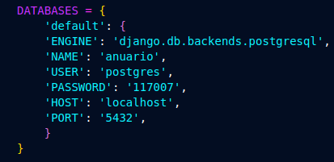

# NentBook

---

## Algunos prerequisitos:

* **Conda** (o Miniconda)
* **Docker** (para levantar la BD de PostgreSQL)

### ⚙️ Activación de entorno ⚙️

Esto principalmente es para que todos tengamos las mismas dependecias y que cada uno no tenga que ir descargando una a una las dependencias que tiene el proyecto xd.

```bash
conda env create -f entorno.yml --name `nombre del env`
conda activate `nombre del env`
```

## 🐳 Base de datos 

Si ya tienes PostgreSQL instalado, crea una base llamada `anuario` o con el nombre que prefieras y ajusta las credenciales que tienes de tu BD en `settings.py` dentro de la carpeta `anuario`. Tambien esta esta otra guia para mas información: [Guía para conectar manualmente BD SQL](Guia%20para%20conectar%20manualmente%20BD%20sql.md)



##  Guia rapida para hacer las migraciones hacia nuestra BD de postgresql 

Estando en la misma altura que `manage.py` el cual se encuentra en `src/Anuario/manage.py`

1. Genera y aplica migraciones:

   ```bash
   python manage.py makemigrations
   python manage.py migrate
   ```
2. (Opcional) Carga datos de ejemplo:

   ```bash
   python manage.py loaddata fixtures/usuariosPrueba.json
   ```

*El archivo de usuariosPrueba.json solo es un archivo donde se subieron algunos datos de pruebas para comprobar la integridad referencial de las tablas y para que no existieran problemas de ese estilo.*

---

## ▶️ Ejecutar el servidor

```bash
python manage.py runserver
```

Abre luego [http://127.0.0.1:8000/](http://127.0.0.1:8000/) en tu navegador.

---


## Extras

* Si se necesita saber mas sobre la conexión y restauración de datos apartir de un .sql puro hacía la BD se puede consular:  
  [Guía para conectar manualmente BD SQL](Guia%20para%20conectar%20manualmente%20BD%20sql.md)

* La estructura de triggers y modelos se encuentra en `app/models.py`.

---
